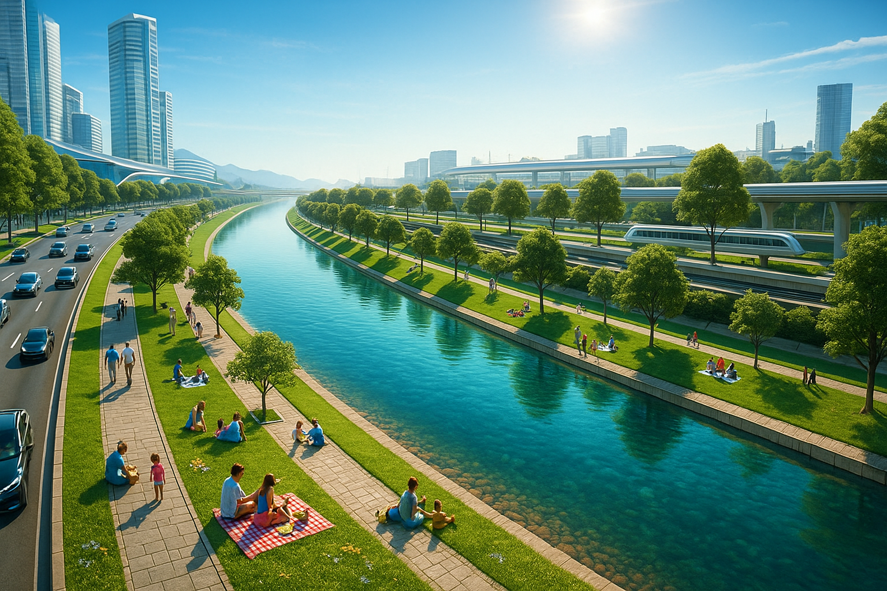

# Como é bom nadar no rio Tietê ;)

## 📒 Descrição
Criação de imagem do Rio Tietê em SP em um estado completamente diferente do atual, li po e com pessoas arredores diverti do em um fim de semana de sol.

## 🤖 Tecnologias Utilizadas

- IA Generativa **[ChatGPT](https://chat.openai.com)** para roteirização
- Pesquisa Google com a foto wue eu gostaria de reformular

## 🧐 Processo de Criação
Baixei uma imagem aonde o rio aparecia com cumprimento e margens,  baixei e anexei ao prompt:
"Crie uma nova imagem se baseando nesta (pode utilizar fontes da web pois trata-sedo rio Tietê e são Paulo capital) onde podemos ver o rio limpos nenhuma sujeira, que contenham pessoas ao redor brincando e fazendo piquenique  em um dia de sol. A imagem deve ser renderizada em modelo futuristico"

## 🚀 Resultados
Abaixo a foto criada com as especificações do prompt

## 💭 Reflexão (Opcional)
É desafiador pois eu nunca vi o rio assim, então é tirar uma fotografia da minha imaginação e traduzirem palavras. 
